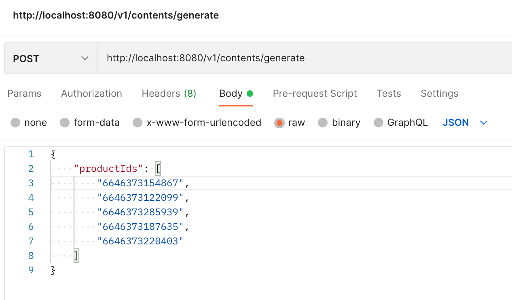

# hypotenuse-dev-task

# Setup

1. **Make a copy of the `.env` file and insert environment variables**

```js
// in root folder
cp .env.example .env;
```

2. **Install Node dependencies**

```js
yarn install
```

3. **Start up Ngrok tunneling**

Note: make sure you have Ngrok installed globally

```js
ngrok http 8080
```

Copy the forwarding URL: `https://{tunnelIP}.ngrok.io`

4. **Update `BASE_URL` in .env file**

```.env
# .env

...other env variables

BASE_URL=<forwarding URL>/v1
```

5. **Start up server**

```js
yarn start
```

# Test

1. Make sure server is running on `PORT: 8080`
2. Run test command

```js
yarn test
```


# Results

1. **Send POST request to `http://localhost:8080/v1/contents/generate`**



2. **API will begin to capture product details and send to Hypotenuse Generator API for processing**


3. **Generator API will send a callback to our webhook. You can see the progress as it updates in the CLI**


4. **A cron job runs in the background every 10s to check for completed batches of transactions**

>  The cron job also checks for those transactions that previously failed to process and will re-try to send them to the Generator API

5. **If there is a completed batch of transactions, it'll create a blog post and send to Shopify**


6. **You can see the now see the generated post on Shopify app!**


# Room for Improvements
- **Serverless Functions** <br>
Node.js/Express is single-threaded and blocking. That means operations in the event loop are not executed unless the previous execution completes. We risk failing an entire process if one of our transactions fail. I'd recommend using serverless functions (e.g. Google Cloud Functions, Azure Functions) to ensure that we do not have to always rollback should any part of the transaction process fails

- **Better caching mechanism** <br>
As this is a quick project, I have used an in-memory hash to cache the succesful content generations while waiting for the rest to complete. This presents a risk as the in-memory cache will completely be wiped out if the server restarts during the transaction process or while waiting for other transactions to complete. I'll recommend using a more sophisticated server-side caching mechanism such as Redis Cache to persist data. 

# Other Observations
- **"Cold start" of Generator API** <br>
I noticed at certain moments, the Generator API may take some time to boot up or respond, especially when it has been idle for awhile, it's observed to take about 1-2s to respond a request.

# Thank you
Thank you Krishna and Joshua for the opportunity to work on this. Please reach out to me for any clarifications 😊